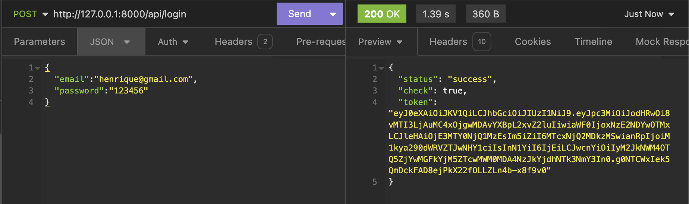
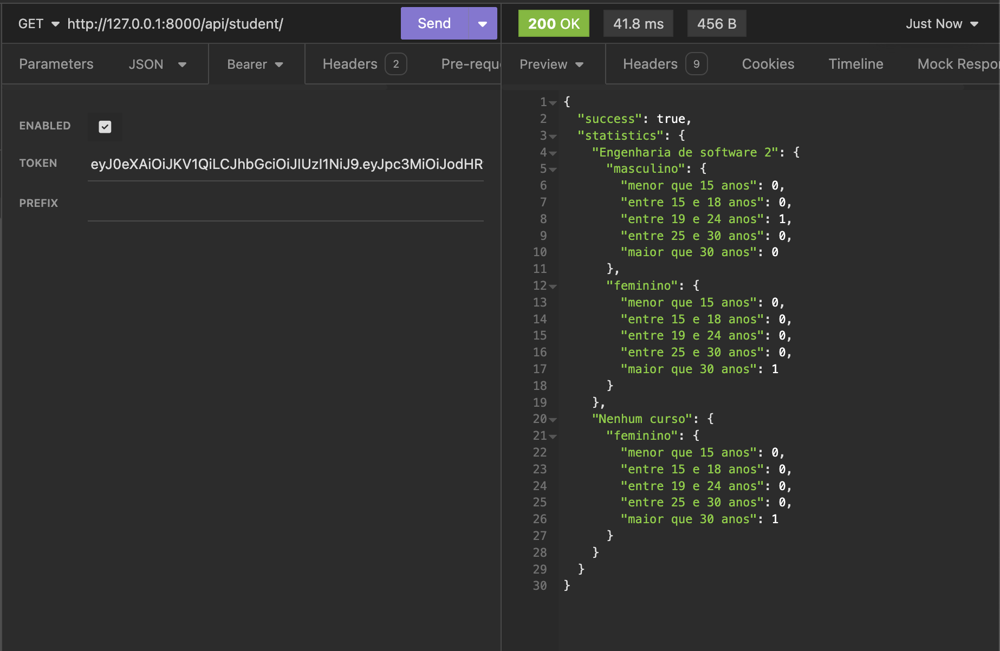
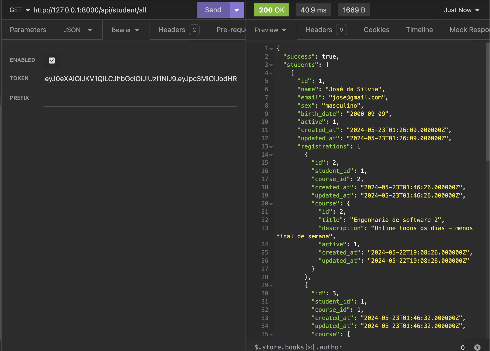

## Plataforma de Ensino Online

Esta aplicação é uma API, desenvolvida com Laravel 10, oferece uma solução completa para gerenciar cursos online, alunos e matrículas. Através das rotas é possível controlar todos os aspectos da plataforma, desde a criação de cursos até a análise de estatísticas detalhadas sobre os alunos.

### Funcionalidades

**Gestão Completa:**

-   **Sistema de usuarios:** Para poder adicionar alunos, cursos e matrícula é necessário ter um usuario.
-   **Middleware:** Para poder adicionar alunos, cursos e matrícula é necessário logado.
-   **Autentificação com JWT:** Adicionado JWT para maior segurança do projeto. Para acessar rotas de criação é necessário ter um tokem bearer valido.
-   **CRUD de Cursos:** Crie, visualize, edite e remova cursos de forma fácil e eficiente. Gerencie os dados dos seus cursos.
-   **CRUD de Alunos:** Crie, visualize, edite e remova alunos de forma fácil e eficiente.Gerencie os dados dos seus alunos.
-   **CRUD de Matrículas:** Matricule alunos em cursos. Crie, visualize, edite e remova matrículas de forma fácil
-   **Pesquisa de Alunos:** Encontre rapidamente os alunos desejados através de filtros por nome e e-mail.
-   **Relatórios Detalhados:** Analise o perfil dos seus alunos com relatórios por faixa etária e sexo.

**Estatísticas Detalhadas:**

A plataforma gera relatórios completos sobre seus alunos, segmentando-os nas seguintes faixas etárias:

-   Menor que 15 anos
-   Entre 15 e 18 anos
-   Entre 19 e 24 anos
-   Entre 25 e 30 anos
-   Maior que 30 anos

Com esses dados, você pode entender melhor seu público e adaptar seus cursos e estratégias de marketing de forma mais eficiente.

### Tecnologia e Arquitetura

**Requisitos:**

-   Git
-   Composer
-   PHP 8.1 ou superior
-   Laravel 10
-   Banco de dados MySQL ou MariaDB

**Tecnologias Utilizadas:**

-   Backend: Laravel 10, PHP 8.1, MySQL/MariaDB
-   Gerenciamento de Dependências: Composer

**Estrutura do Projeto:**

```
plataforma_ensino_online/
├── app/
│   ├── Console/
│   ├── Exceptions/
│   ├── Http/
│   │   ├── Controllers/
│   │   ├── Middleware/
│   ├── Models/
│   ├── Providers/
├── bootstrap/
├── config/
├── database/
│   ├── factories/
│   ├── migrations/
│   ├── seeders/
├── public/
├── resources/
│   ├── views/
├── routes/
│   ├── api.php
│   ├── web.php
├── storage/
├── tests/
├── .env.example
├── composer.json
├── package.json
├── README.md
└── artisan
```

### Instalação e Utilização

**Pré-requisitos:**

-   PHP 8.1 ou superior
-   Composer
-   MySQL ou MariaDB
-   Git

**Passos para Instalação:**

1. Clone o repositório:

    ```bash
    git clone https://github.com/seu-usuario/plataforma_ensino_online.git
    cd plataforma_ensino_online
    ```

2. Instale as dependências do Composer:

    ```bash
    composer install
    ```

3. Copie o arquivo `.env.example` para `.env` e configure o banco de dados e outras variáveis de ambiente:

    ```bash
    cp .env.example .env
    ```

4. Gere a chave da aplicação:

    ```bash
    php artisan key:generate
    ```

5. Execute as migrações para criar as tabelas no banco de dados:

    ```bash
    php artisan migrate
    ```

6. Gere a chave jwt

    ```bash
    php artisan jwt:secret
    ```

7. Inicie o servidor de desenvolvimento:

    ```bash
    php artisan serve
    ```

8. Acesse a aplicação no navegador:
    ```
    http://localhost:8000
    ```

### Rotas da API

**Autenticação:**

-   `POST /login`: Realiza o login do usuário.
-   `POST /logout`: Realiza o logout do usuário.
-   `POST /register`: Registra um novo usuário.
-   `GET /me`: Retorna as informações do usuário autenticado.

**Alunos:**

-   `GET /student/all`: Retorna uma lista de todos os alunos.
-   `POST /student/create`: Cria um novo aluno.
-   `GET /student/{id}`: Retorna os detalhes de um aluno específico.
-   `PUT /student/{id}/update`: Atualiza os dados de um aluno.
-   `DELETE /student/delete`: Exclui um aluno.
-   `POST /student/search`: Busca alunos por nome ou e-mail.
-   `GET /student/`: Obter o total de alunos por faixa etária, curso e sexo.

**Cursos:**

-   `GET /course/all`: Retorna uma lista de todos os cursos.
-   `POST /course/create`: Cria um novo curso.
-   `GET /course/{id}`: Retorna os detalhes de um curso específico.
-   `PUT /course/{id}/update`: Atualiza os dados de um curso.
-   `DELETE /course/delete`: Exclui um curso.

**Matrículas:**

-   `GET /registration/all`: Retorna uma lista de todas as matrículas.
-   `POST /registration/create`: Cria uma nova matrícula.
-   `GET /registration/{id}`: Retorna os detalhes de uma matrícula específica.
-   `PUT /registration/{id}/update`: Atualiza os dados de uma matrícula.
-   `DELETE /registration/delete`: Exclui uma matrícula.

### Autenticação

As rotas do grupo `student`, `course` e `registration` estão protegidas por autenticação utilizando `auth:api` middleware. Isso significa que para acessar essas rotas, o usuário precisa estar autenticado na aplicação enviando um token JWT válido nas requisições.

### Extras

-   As tabelas do banco de dados são criadas através de migrations.

---

**Observações:**

-   Este README.md fornece uma visão geral da aplicação.

### Telas




